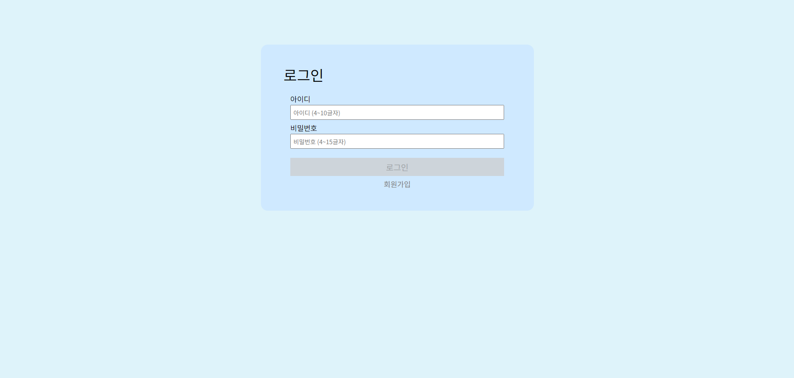
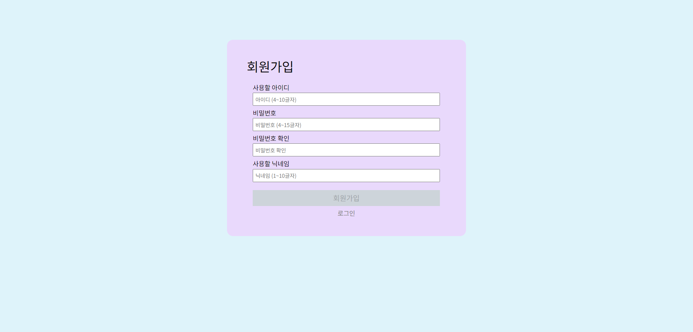
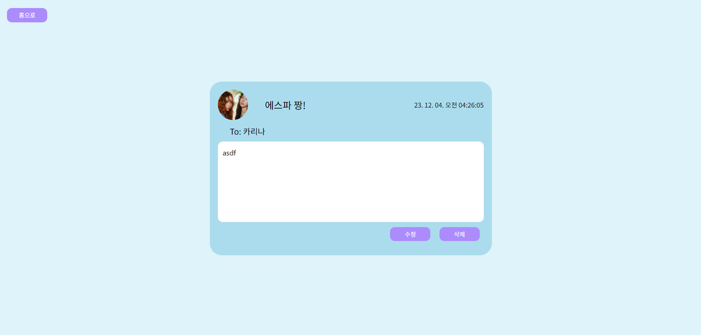
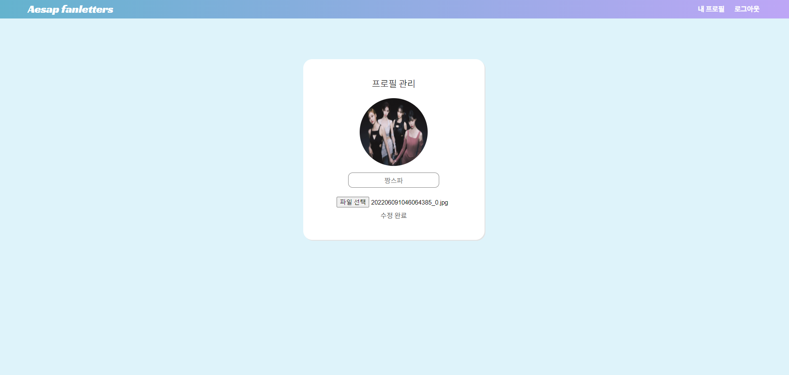

# 에스파 팬래터 작성 페이지

**Redux Toolkit으로 리팩토링 및 json-server 를 이용한 REST API 통신**

이전 프로젝트: https://github.com/ys-oul/fanLetter.git

## .png>))

### 개발 기간

: 23. 11. 29 ~ 23. 12. 4

---

### 프로젝트 설치 및 실행 방법

- json server는 환경변수 설정 했습니다
- _package.json 파일 참고_

---

### 주요 기능

- 로그인 해야만 메인 페이지 및 상세페이지, 개인 페이지로 이동 가능
  
  

- 로그인 시 메인 화면으로 이동 및 펜레터 작성 가능

- 펜레터 카드 클릭 시 상세화면으로 이동, 작성자만 수정/삭제 가능
  

- 상단 네비게이션 바에서 홈화면 이동/개인 페이지 이동/로그아웃 가능

- 개인 페이지에서 프로필 이미지 및 닉네임 변경 가능
  
